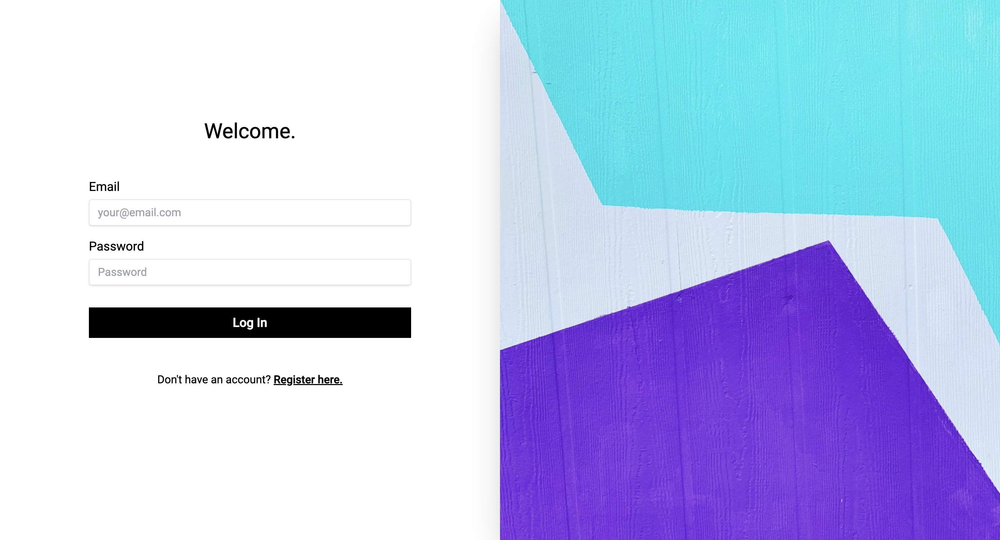

# News

This is a technical test for a small crud app for news.

## API Reference

#### Register

```http
  POST /api/register
```

| Parameter | Type     | Description                |
| :-------- | :------- | :------------------------- |
| `name` | `string` | user name |
| `email` | `string` | email of the user |
| `password` | `string` | password of the user |

#### Login

```http
  POST /api/login
```

| Parameter | Type     | Description                |
| :-------- | :------- | :------------------------- |
| `email` | `string` | email of the user |
| `password` | `string` | password of the user |

#### Get all categories

```http
  GET /api/categories
```

| Parameter | Type     | Description                |
| :-------- | :------- | :------------------------- |
| `id` | `integer` | category id |
| `name` | `string` | category name |
| `parent_id` | `integer` | parent category id |

#### Delete news

```http
  DELETE /api/news/${id}
```

| Parameter | Type     | Description                       |
| :-------- | :------- | :-------------------------------- |
| `id`      | `integer` | **Required**. Id of news to delete |

#### Fetch one news

```http
  DELGETETE /api/news/${id}
```

| Parameter | Type     | Description                       |
| :-------- | :------- | :-------------------------------- |
| `id`      | `integer` | **Required**. Id of news to fetch |

#### Update news

```http
  PUT /api/news/${id}
```

| Parameter | Type     | Description                       |
| :-------- | :------- | :-------------------------------- |
| `id`      | `integer` | **Required**. Id of news to update |
| `title`      | `string` | **Required**. title of news to update |
| `content`      | `string` | **Required**. content of news to update |
| `category_id`      | `integer` | **Required**. id of category of the news to update |
| `debut_date`      | `string` | **Required**. debut date of news to update |
| `expiration_date`      | `string` | **Required**. expiration date of news to update |

#### Create news

```http
  POST /api/news
```

| Parameter | Type     | Description                       |
| :-------- | :------- | :-------------------------------- |
| `title`      | `string` | **Required**. title of news |
| `content`      | `string` | **Required**. content of news |
| `category_id`      | `integer` | **Required**. id of category of the news |
| `debut_date`      | `string` | **Required**. debut date of news |
| `expiration_date`      | `string` | **Required**. expiration date of news |


## Tech Stack

**Client:** Angular, RxJs, Ngrx, Angular Material UI, TailwindCSS

**Server:** Laravel

**Database:** PostgreSql


## Deployment

To deploy or run this project on your machine browse to the backend folder first using

```bash
  cd backend
```

create your .env file with the credentials of your database

```bash
  touch .env
```

after that run this command to install the needed dependecies

```bash
  composer install
```

the next step is to run the migrations using

```bash
  php artisan migrate
```

and the final step in the backend part is to run the server using

```bash
  php artisan serve
```

After setting up the backend go back to the root path and browse to the frontend folder using the following commands

```bash
  cd ..
```

```bash
  cd frontend
```

install the dependecies using

```bash
  npm install
```

then you're good to run your application using

```bash
  ng serve
```

## Screenshots of the app





